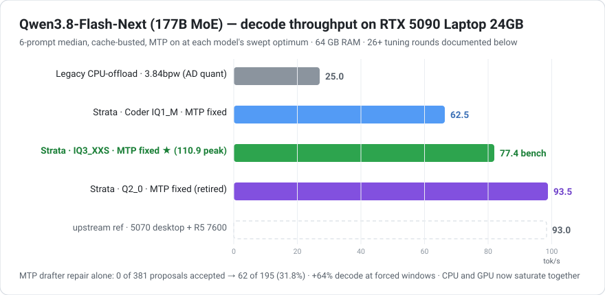

# Qwen3.8-Flash-Next 177B on an RTX 5090 Laptop

**24 GB VRAM + 64 GB RAM · 256K Context · 110 tok/s peak · 100+ sustained · Vision Enabled**

[中文 →](./README.md) ｜ **English**


---

## ⚡ Strata engine era — 26 measured rounds · 7 quant tiers screened · 25+ parameter sweeps · peak 110 tok/s

**The screening**: 2 engine families (legacy CPU-offload engine, Strata 0.1.27/0.1.28), 7 quant tiers (AtomicChat AD-3.84bpw / ISTA-DASLab Coder IQ1_M / Q2_0 / IQ2_XS / IQ3_XXS / IQ3_S / Qwen BF16), 25+ parameter sweep points, 12 hypotheses eliminated one by one — landing on two "bests":

- **Speed-first**: ISTA-DASLab GSQ-RCO Q2_0 (full 512-expert) · **93.5 tok/s** (matches the desktop 5070 reference)
- **Quality-first (current daily driver)**: ISTA-DASLab GSQ-RCO IQ3_XXS (full 512-expert) · 77.4 tok/s benchmark; **110.9 tok/s peak** on real-world workloads, 101-103 tok/s on 3,000+ token outputs (256K + Vision both on)
- Bonus: ISTA-DASLab Coder IQ1_M (256/512-expert pruned; 62.5 tok/s, half the RAM — multi-instance / extra-long context backup)



### Four headline findings

1. **GPU and CPU saturate together, for the first time**: legacy CPU-offload engines pinned one CPU core at 100% while the GPU idled at 20-40%; Strata's three-tier scheme (hot-expert VRAM cache + CPU pool + overlapping MTP pipeline) loads both processors at once — the structural reason behind the multiple-fold gain
2. **The dead-MTP mystery**: 20 of 31 drafter weight files were corrupted downloads (a mirror ignored the HTTP Range header; the tool saved the shard headers). sha256 over downloaded bytes cannot catch this. Self-compiled the engine with NaN probes → re-fetched → MTP acceptance 0% → 70.8%. Full postmortem: [docs/mtp-corruption-postmortem.md](./docs/mtp-corruption-postmortem.md) (filed upstream as [Strata#327](https://github.com/Niko1221/Strata/issues/327), **confirmed and fixed in v0.1.32**: HTTP 206 + Content-Range enforced, per-tensor SHA-256 against the pinned revision, corrupt tensors auto re-fetched)
3. **The spec_min_p peak moves per model**: Q2_0 peaks at 0.3, IQ3_XXS at 0.7 — re-sweep on every model change (curve below)
4. **256K context is nearly free**: with KV streaming, 65K/128K/256K cost the same; verified stable on 64 GB RAM. Vision coexists with 256K (≤1,024 tokens/image — 250+ images per conversation)


## 🚀 Deploy & launch (follow along)

> Engine [Strata](https://github.com/Niko1221/Strata) (MIT License), Windows/Linux; only an NVIDIA driver is needed. Python 3.12 is installed into your user folder by the installer (no admin rights).

**① Get the engine**: follow the Strata README (download the release `strata-windows-x64.zip`, or git clone the source repo).

**② One command packs the model and writes the config** (our two active models):

```bat
cd Strata/app

:: quality-first (the daily config in this repo): IQ3_XXS
python setup.py --family qwen --model IQ3_XXS --context 131072 --vision yes --port 8081 --yes --gguf-dir "D://models//Qwen3.8-Flash-Next-GSQ-RCO-GGUF"

:: speed-first: Q2_0
python setup.py --family qwen --model Q2_0 --context 32768 --vision yes --port 8081 --yes --gguf-dir "D://models//Qwen3.8-Flash-Next-GSQ-RCO-GGUF"
```

- `--gguf-dir` must point to a folder with the GGUF shards **you already downloaded**; without it, setup re-downloads tens of GB
- First run auto-installs Python 3.12, creates an isolated .venv, downloads the engine and packs the expert profile (double-click `START-HERE.bat` for the interactive path)

**③ Launch**: re-run the same command or double-click `START-HERE.bat`, then open `http://127.0.0.1:8081/` (OpenAI / Anthropic APIs on the same port).

**④ Want 256K context**: setup conservatively caps IQ3 models at 128K. We verified 256K is stable on 64 GB RAM — edit `strata-iq3_xxs.json` after setup: set `--max-context` to `262144` and add `"--kv-resident", "32768"` (KV in RAM, a 32K hot window in VRAM), restart. Data: [context ladder](./results/strata-ctx-ladder-iq3.txt).

**⑤ Verify MTP is alive**: the log must show non-zero `drafts accepted`. If you see `0 of 0` or `0 of N`, run [tools/check_dense.py](./tools/check_dense.py) on the drafter weights first — most likely a corrupted download (full method in the [postmortem](./docs/mtp-corruption-postmortem.md)).

**⑥ Thinking & concurrency (read before wiring up a client)**:
- **Thinking defaults to xhigh — the highest tier**, hard-coded in the chat template. The ladder is `xhigh` (default) > `medium` > `low`; there is no "high" (it silently escalates to xhigh). For everyday speed pass `reasoning_effort: low` ("brief and straight to the point"); keep the default for hard reasoning
- **Concurrency = none, FIFO serial**: the HTTP layer is threaded and accepts parallel connections, but one FIFO lock means a single decode at any moment — later requests queue (nothing dropped or refused; `GET /status` shows the queue). Invisible for one user; a second client waits its turn
- **max_tokens**: the engine fills a default if you omit it, but with a thinking model always pass ≥600 explicitly

**License & compliance**: the Strata engine is MIT; llama.cpp / ggml are MIT; model-weight licenses follow each HF page (the GSQ-RCO pages are tagged Apache-2.0, inherited from the base model). This repo contains only our measurement data and tools — **no model weights are redistributed**; all trademarks belong to their owners.

---

### The 18 tuning rounds of the Strata era

| R | Action | Result | Decision |
|---|---|---|---|
| R1 | Strata 0.1.27 install + Coder IQ1_M first run | 58.4 tok/s | engine viable (+133% vs llama.cpp) — continue |
| R2 | Q2_0 packed + first run | 66.7 tok/s | MTP anomaly surfaces (`0 of 0`) |
| R3 | Sampling sweep (temperature/seed/length) | no change | ruled out |
| R4 | Expert-count mismatch → switch to 512-expert full | still 0 | ruled out |
| R5 | draft_vocab CJK check (upstream #137) | already fixed | ruled out |
| R6 | IQ kernel width (upstream #152) → bypass tested | still 0 | ruled out |
| R7 | Read engine source: semantics of `0 of 0` | T always 1 | **turning point: drafts never proposed** |
| R8 | Force windows open (`spec_min_p=0`) | `0 of 765` | proposals 100% wrong → the drafter itself is broken |
| R9 | Self-compiled engine + NaN probe | `dprob=NaN` | first matmul already NaN → weights suspected |
| R10 | Per-file weight audit | 20/31 are shard headers | **root cause: ignored Range headers** |
| R11 | Re-fetch 20 files + re-pack + verify clean | `62 of 195` | **MTP alive (+64%)** |
| R12 | Q2_0 `spec_min_p` sweep | peak 0.3 = **93.5** | fixed |
| R13 | Upgrade to 0.1.28 + retest | unchanged | version ruled out |
| R14 | IQ3_XXS deploy + sweep | peak 0.7 = **77.4** | fixed (quality-first line) |
| R15 | Context ladder 32K/65K/128K/256K | 256K stable | KV streaming configured |
| R16 | Vision mounted + recognition check | all correct | 74.4 tok/s @256K+Vision |
| R17 | spec 6 / k8v4 / pcie_frac re-sweeps | all worse | rejected, documented |
| R18 | Cache-busted fair re-test (+ README + postmortem + issue#327) | **74.4 final** | shipped |

> 📘 **Full Strata log (English)** → [docs/strata-log.en.md](./docs/strata-log.en.md) ｜ [中文](./docs/strata-log.zh.md)
> 🔬 **MTP corruption postmortem** → [docs/mtp-corruption-postmortem.md](./docs/mtp-corruption-postmortem.md) (upstream [Strata#327](https://github.com/Niko1221/Strata/issues/327))
> 🧪 **Raw data** → [results/strata-*.txt](./results/strata-mtp-repair.txt)　🛠 **Repair tools** → [tools/](./tools/check_dense.py)

---

## Model dossier: every quant we touched (strength / why chosen / outcome)

**4 model repos, 7 quant tiers** were involved end to end.

> **Vendors & quantization schools at a glance**
>
> - **ISTA-DASLab** (Deep Algorithms and Systems Lab at the Institute of Science and Technology Austria — the group behind GPTQ and QuIP#, among the most authoritative teams in low-bit quantization) — the main repo this project uses. Their **GSQ** (Gumbel-Softmax Quantization: scalar quantization approaching VQ accuracy at 2-3 bits) and **RCO** (Riemannian Constrained Optimization: per-tensor bit allocation under a total budget) are both published methods; together they produce the GSQ-RCO series
> - **AtomicChat** — the AD family of per-layer dynamic-precision quants (AD-5.00bpw-Q5_K_M / AD-4.27bpw-Q4_K_M / AD-3.84bpw-IQ4_XS-M64); the main supplier during the llama.cpp era
> - **Unsloth** (UD family) — entered the candidate pool, eliminated after a size/shard evaluation
> - **The Qwen team** (Alibaba) — the original Qwen3.8-Flash-Next model (176B MoE, hybrid GDN/QSA architecture) and the only source of the MTP drafter weights

| # | Model / quant | Effective | Repo | Status |
|---|---|---|---|---|
| 1 | AtomicChat AD-3.84bpw-IQ4_XS-M64 | 3.84 bpw | [AtomicChat/Qwen3.8-Flash-Next-GGUF](https://huggingface.co/AtomicChat/Qwen3.8-Flash-Next-GGUF) | llama.cpp era main |
| 2 | ISTA-DASLab GSQ-RCO **Q2_0** | ~2.2 bpw | [ISTA-DASLab/Qwen3.8-Flash-Next-GSQ-RCO-GGUF](https://huggingface.co/ISTA-DASLab/Qwen3.8-Flash-Next-GSQ-RCO-GGUF) | ✅ **active (speed)** |
| 3 | ISTA-DASLab GSQ-RCO **IQ3_XXS** | ~3.1 bpw | same repo | ✅ **active (quality)** |
| 4 | ISTA-DASLab GSQ-RCO IQ3_S | ~3.44 bpw | same repo | ⛔ evaluated, rejected |
| 5 | ISTA-DASLab GSQ-RCO IQ2_XS | ~2.5 bpw | same repo | ⛔ evaluated, not deployed |
| 6 | ISTA-DASLab Coder **IQ1_M** (256/512-expert pruned) | 1.89 bpw | [ISTA-DASLab/Qwen3.8-Flash-Next-GSQ-RCO-Coder-GGUF](https://huggingface.co/ISTA-DASLab/Qwen3.8-Flash-Next-GSQ-RCO-Coder-GGUF) | ✅ backup (low-RAM) |
| 7 | Qwen (Alibaba) BF16 official checkpoint | 16 bpw | [Qwen/Qwen3.8-Flash-Next](https://huggingface.co/Qwen/Qwen3.8-Flash-Next) | 🔧 MTP weights source only |
| 8 | mmproj BF16 Vision Encoder | — | in the GSQ-RCO repo | ✅ active |

**1️⃣ AtomicChat AD-3.84bpw-IQ4_XS-M64** — dynamic per-layer precision at ~4 bits; the only community-validated quant that ran the 177B MoE in 24 GB via llama.cpp. Outcome: 22-25 tok/s, exposing llama.cpp's single-core CPU ceiling. Led to the engine switch.

**2️⃣ ISTA-DASLab GSQ-RCO Q2_0 ★ (speed king)** — 2-bit backed by two published methods (GSQ + RCO per-tensor budget allocation); smallest expert blobs → the most VRAM hot-expert slots (13,212, 98%+ hit rate) → MTP gains fully realized. Outcome: **93.5 tok/s** (spec_min_p=0.3), acceptance 44-54%, matches the desktop 5070 reference.

**3️⃣ ISTA-DASLab GSQ-RCO IQ3_XXS (quality line, current daily)** — a full bit more precision; also the best drafter (59-71% acceptance — mind that its spec_min_p peak is 0.7, not Q2_0's 0.3). Outcome: **77.4 tok/s** (32K) / 74.4 (256K+Vision). The 42.9 GB arena leaves comfortable headroom for 256K on 64 GB RAM.

**4️⃣ ISTA-DASLab GSQ-RCO IQ3_S (evaluated, rejected)** — 3.44 bpw, upstream reports it *matches the full BF16 model* — the best quality of all. But its 50.3 GB pinned arena + 3.1 GB KV at 256K leaves ~10 GB for the OS on a 64 GB machine; upstream itself flags "64 GB PC with little else running". With 256K as a hard requirement, the risk was unacceptable. **Revival condition: a RAM upgrade to 96 GB.**

**5️⃣ ISTA-DASLab GSQ-RCO IQ2_XS (evaluated, not deployed)** — slightly better than Q2_0 at nearly the same speed. Its quality increment sits between Q2_0 and IQ3_XXS; when quality became the priority we jumped straight to IQ3_XXS, so the middle tier had no deployment window.

**6️⃣ ISTA-DASLab Coder IQ1_M (low-RAM backup)** — upstream pruned 512→256 experts (keeping code/tool/vision experts), halving the arena to 23.4 GB while storing at "IQ3_S-like" 3.5-bit density. Outcome: 62.5 tok/s post-MTP-fix; weaker than the full model outside coding, as expected from the pruning.

**7️⃣ Qwen BF16 official checkpoint (MTP weights source only)** — 354 GB, not locally deployable. Downloaded solely because the MTP drafter weights (`mtp.*` tensors) exist only in the BF16 checkpoint — pulled 5.2 GB via HTTP Range instead of the full 360 GB. This is also what triggered the [corruption incident](./docs/mtp-corruption-postmortem.md) and the resulting detector/fixer tooling.

**8️⃣ mmproj BF16 Vision Encoder** — 27-layer ViT + projector; ≤1,024 tokens/image, 0.1-0.5 s/image on GPU. Mounted and verified; ~16% text speed cost at 256K+Vision.

---


## What this is

Running a **177B-parameter MoE model** on a **consumer laptop** — not just "it loads", but **actually usable day to day**:

- **Full 256K context** (~192k words — a whole book)
- **25.0 tok/s generation** (faster than human reading speed)
- **Vision enabled** (image understanding works)
- **23.4 / 24 GB VRAM**, stable for long sessions

This repo documents the **complete tuning journey** from scratch: quant selection, three-tier memory split, parameter sweeps, and **12 dead-end directions** we ruled out (so you don't have to re-test them).

> 📘 **Visual quick-reference page** → [index.html](./index.html)
> 🧪 **Raw measurements** → [results/](./results/)
> 🛠 **Reusable test tools** → [tools/](./tools/)
> 📄 **Deep write-up** → [中文](./docs/deploy-log.zh.md) ｜ [English](./docs/deploy-log.en.md)
> 🔧 **Port to other hardware** → [porting-guide.md](./docs/porting-guide.md)

**Table of contents**

- [Results at a glance](#results-at-a-glance)
- [Quick start](#quick-start)
- [Architecture: three-tier split](#architecture-three-tier-split)
- [The full tuning journey (8 steps)](#the-full-tuning-journey-8-steps)
- [Benchmarks](#benchmarks)
- [Tested and ruled out (12 items)](#tested-and-ruled-out-12-items)
- [FAQ](#faq)
- [Hardware upgrade paths](#hardware-upgrade-paths)
- [Key takeaways](#key-takeaways)

---

## Results at a glance

| Metric | Final |
|---|---|
| Generation speed | **25.0 tok/s** |
| Context | **262,144 tokens = 256K** (model's full length) |
| Quant | **AD-3.84bpw-IQ4_XS-M64** (79.10 GiB / 28 shards) |
| KV cache | q8_0 (accuracy verified lossless) |
| VRAM usage | **23.4 / 24 GiB** |
| System RAM | ~33 GB resident (expert layers) |
| Vision | ✅ mmproj-F16 (+0.85 GiB) |
| MTP speculative decoding | ❌ **disabled** (measured net-negative — see Step 6) |

### Context tiers

| Use case | Context | ncmoe | Measured decode | VRAM |
|---|---:|---:|---:|---:|
| ⚡ Speed-first | 114,688 (112K) | 32 | **27.12 tok/s** | 23.2 GiB |
| Balanced | 163,840 (160K) | 33 | 25.83 tok/s | 23.3 GiB |
| Long docs | 196,608 (192K) | 34 | 25.31 tok/s | 23.1 GiB |
| **🏆 Full length (recommended)** | **262,144 (256K)** | **36** | **25.08 tok/s** | 23.4 GiB |

> **Why 256K wins**: it is only **7.5% slower** than 112K, but the context is **2.3× larger** — capacity gain far outweighs the speed cost.

---

## Get the model

All model files come from public Hugging Face repos ([Qwen Community License 1.0](https://huggingface.co/Qwen/Qwen3.8-Flash-Next/blob/main/LICENSE)):

| File | Description | Size | Source |
|---|---|---|---|
| ⭐ **AD-3.84bpw-IQ4_XS-M64** | **Main model** (28 shards) | **84.9 GB** | [**AtomicChat/Qwen3.8-Flash-Next-GGUF**](https://huggingface.co/AtomicChat/Qwen3.8-Flash-Next-GGUF) |
| mmproj-Qwen3.8-Flash-Next-F16.gguf | Vision projector (optional) | 0.85 GB | [Same repo](https://huggingface.co/AtomicChat/Qwen3.8-Flash-Next-GGUF) |
| llama.cpp | Inference engine (needs a build with Qwen3.8-Flash-Next support) | — | [ggml-org/llama.cpp](https://github.com/ggml-org/llama.cpp) |
| Qwen/Qwen3.8-Flash-Next | Original weights (reference only) | — | [Qwen official](https://huggingface.co/Qwen/Qwen3.8-Flash-Next) |

```bash
# Download main model + vision projector (resumable)
pip install -U "huggingface_hub[cli]"
hf download AtomicChat/Qwen3.8-Flash-Next-GGUF \
  --include "*3.84bpw*" --include "*mmproj*" \
  --local-dir D:\models\Qwen3.8-Flash-Next
```

> [!IMPORTANT]
> **Use the AtomicChat `-M64` variant — not other publishers' similar quants.**
>
> The difference isn't bit-width, it's **shard layout**: only AtomicChat puts the N-gram table (35.8 GB) in **its own shards**.
> Other publishers (e.g. unsloth's UD series) mix the table in with the experts — touching that shard pulls the **entire shard** (tens of GB) into RAM, which crushes a 64 GB machine.
>
> Measured: mixed-shard quants silently crash on long conversations at 60K–100K tokens; the AtomicChat build fills the entire 256K context stably.

**Hardware prerequisites**: 24 GB VRAM + 64 GB RAM + NVMe SSD (the configuration measured here).

---

## Quick start

### 1. Launch

```bash
llama-server \
  -m Qwen3.8-Flash-Next-AD-3.84bpw-IQ4_XS-M64-00001-of-00028.gguf \
  -ngl 99 --n-cpu-moe 36 \
  -fa on -fit off \
  -c 262144 -np 1 \
  -ctk q8_0 -ctv q8_0 \
  --load-mode dio \
  -mm mmproj-Qwen3.8-Flash-Next-F16.gguf \
  --jinja --alias qwen3.8-flash-next \
  --host 127.0.0.1 --port 8080
```

> ⚠️ **Note: no `-md` / `--spec-type`** — MTP is disabled (net-negative, see below).
> Loading takes ~30–60 s. You're ready when you see `listening on http://127.0.0.1:8080`.

### 2. Client configuration

| Field | Value |
|---|---|
| API type | OpenAI compatible |
| **Base URL** | `http://127.0.0.1:8080/v1` |
| **Model name** | `qwen3.8-flash-next` |
| API Key | anything (e.g. `sk-local`) |
| **Streaming** | **must be enabled** |
| Context length | `262144` |
| **max_tokens** | **16000** (thinking can be long; too small = "thinks but never answers") |
| Reasoning effort | defaults to **xhigh** when not sent |

### 3. Three rules

1. **One instance only** — multiple instances will exhaust VRAM (23 GB each)
2. **Shut it down when idle** — it holds 23 GB VRAM
3. **Restart the process after changing config** — parameters are read only at startup

---

## Architecture: three-tier split

The core idea: **allocate storage by access frequency**, not by "cramming into VRAM".

| Tier | What lives here | Why | Size |
|---|---|---|---|
| **VRAM** 24GB | Attention layers + 12 expert layers + KV cache + vision projector | Used by every token, **1.8 TB/s** bandwidth | 23.4 GB |
| **RAM** 64GB | Remaining 36 expert layers | Sparse activation (10 of 512 experts per token), **62 GB/s** is enough | ~33 GB |
| **NVMe SSD** | N-gram lookup table (35.8GB) | Read directly in `dio` mode, occupies no RAM | 35.8 GB |

**Why this split works**: attention is needed by every token, so it must sit in the fastest memory. Expert layers activate sparsely, so they can live in slower-but-larger system RAM and be computed by the CPU. That's how a 79 GB model fits in 24 GB of VRAM.

### Where the bottleneck is

Measured **GPU utilization is only ~25%** during inference, while the CPU runs near saturation. This is unavoidable when experts are computed on the CPU:

```
Generating 1 token walks through all 48 layers in sequence:
GPU attn(L1) → CPU experts(L1) → GPU attn(L2) → CPU experts(L2) → ... ×48
   ↑ working       ↑ idle           ↑ working       ↑ idle
```

**To saturate the GPU you'd have to put more experts in VRAM — and VRAM is already full.**

> For reference: if the 79 GB model could fit entirely in VRAM (~4× RTX 5090), utilization would reach 80%+.

---

## The full tuning journey (8 steps)

Every step records **what we did / what we found / why it worked or didn't**.

### Step 0 · Choosing the right quant *layout* (decisive)

**The filter isn't bit-width — it's shard layout**: whether the N-gram table (35.76 GiB) gets its **own shards**.

| Quant | Size | Layout | Measured here | Verdict |
|---|---:|---|---|---|
| ⭐ **AD-4.27bpw-Q4_K_M-M64** | 88.03 GiB / 33 shards | ✅ Table has own shards | 21.7 (32K) / 24.6–28.2 (64K) | ✅ Previous primary |
| ⭐ **AD-3.84bpw-IQ4_XS-M64** | 79.10 GiB / 28 shards | ✅ Table has own shards | **25.0 tok/s (256K)** | ✅ **Current primary** |
| AD-5.00bpw-Q5_K_M-M64 | 102.93 GiB / 33 shards | ✅ Own shards (table 50.66 GiB) | not tested | ⚠️ Larger table → more SSD pressure |
| unsloth UD-IQ4_XS | 87.25 GiB / 3 shards | ❌ Mixed | not tested | ❌ **Unusable**: whole shard locked into RAM, worst case 89.6 GiB resident > 64 GiB |
| unsloth UD-Q3_K_XL | 83.80 GiB / 3 shards | ❌ Mixed | not tested | ❌ Same problem |
| NVFP4 | — | — | — | ❌ Not published for this model (enumerated all **164 files**, zero hits) |

**Why layout is decisive**: a GGUF shard is the smallest unit of mmap. If the table shares a shard with experts, touching that shard pulls the **entire shard** (potentially tens of GB) into RAM — fatal on a 64 GB machine. Only "table-owns-its-shards" layouts let dio/mmap page precisely on demand.

**Why we settled on 3.84bpw**: beyond layout, it's the speed/quality sweet spot —

| | 4.27bpw | **3.84bpw** |
|---|---|---|
| Size | 88.03 GB | **79.10 GB** |
| Expert quant | IQ2_S (2.5 bit) | **IQ4_XS (4.25 bit)** |
| Free RAM | 12.8 GB | **26.2 GB** |

**Counter-intuitive**: 3.84bpw has **higher** expert precision (4.25 bit vs 2.5 bit) — it compresses *other* parts to shrink overall size. **Switching to it is not a downgrade.**

### Step 1 · Fitting 79GB into 24GB VRAM — `--n-cpu-moe`

```
-ngl 99              ← all layers on GPU (key: do NOT lower this to fit the model!)
--n-cpu-moe 36       ← keep expert weights of the first 36 layers on CPU
```

**Key insight**: don't reuse dense-model habits of tuning `-ngl`. For MoE, **keep all attention on the GPU** (used by every token) and move only the **routed experts** (sparsely activated) to RAM.

**Two silent failures to guard against**:

| Failure | Symptom | Cause |
|---|---|---|
| Missing CUDA runtime | Speed drops to single digits, **no error** | Silent CPU fallback |
| VRAM oversubscription | 30× slower, **no error** | Silent PCIe spill |

### Step 2 · KV quantization (q8_0) — best value per byte

KV cache doesn't participate in compute but occupies VRAM. Quantize it → free VRAM goes to more expert layers:

| Config | ncmoe | Speed | Long-context recall |
|---|---:|---:|---|
| f16 KV (baseline) | 42 | 21.34 tok/s | 12/12 = 100% |
| **q8_0 KV** ⭐ | **38** | **22.07 (+3.4%)** | **12/12 = 100%** |
| q4_0 KV | 36 | 25.03 (no faster) | 12/12 = 100% |

> Accuracy verified with **multi-round randomized needle-in-a-haystack**: 9.7k-token document, 3 facts at random depths, same seed across configs, checking `finish_reason` to rule out truncation artifacts.

**Conclusion: q8_0 is lossless and 3.4% faster.**

### Step 3 · `dio` load mode — frees 13 GB of RAM

```
--load-mode dio    ← bypass page cache, read SSD directly
```

**Effect**: free RAM went from **7 GB → 20 GB**. The N-gram table (35.8 GB) is no longer duplicated in the page cache.

**Why it works**: NVMe random-read bandwidth (1.3 GB/s+) is enough to feed CPU-side expert compute; the page-cache benefit doesn't justify the RAM it consumes.

### Step 4 · Switch to the 3.84bpw model — save 8.9 GB, add 4 expert layers

**The chain**:
```
Model 88.03 GB → 79.10 GB (save 8.94 GB)
  → VRAM usage drops 2.4 GB
  → 4 more expert layers fit in VRAM
  → less CPU work → faster
  → RAM usage also drops → free RAM 12.8 GB → 26.2 GB
```

**A double win**: speed and memory improve together.

### Step 5 · Context tuning — finding the "VRAM pressure cliff"

| Context | ncmoe | decode | vs 128K |
|---|---:|---:|---:|
| 128K | 36 | 21.60 tok/s | baseline |
| 112K | 36 | 24.98 tok/s | **+15.6%** |
| 96K | 36 | 24.57 tok/s | +13.7% |
| 80K | 36 | 25.37 tok/s | +17.4% |
| 64K | 35 | 25.81 tok/s | +19.5% |
| 32K | 35 | 26.61 tok/s | +23.2% |

**Finding**: 128K → 112K is just **16K less context, yet 15.6% faster**. There's a "VRAM pressure cliff" — at 128K the memory is so tight that allocation overhead peaks.

### Step 6 · ⭐ Disabling MTP — the single biggest win (+23%)

**This step overturned the original assumption.**

MTP (Multi-Token Prediction) speculative decoding sounds like a win — a draft model guesses tokens, the main model verifies them in one pass, saving forward passes. **But in a MoE + CPU-expert architecture it's net-negative**:

| Config | VRAM | decode |
|---|---:|---:|
| MTP on + ncmoe=36 | 23.5 GB | **22.0 tok/s** |
| **MTP off** + ncmoe=36 | 20.2 GB | **25.4 tok/s** |
| MTP off + ncmoe=34 | 21.1 GB | 26.93 tok/s |
| **MTP off + ncmoe=32** | 23.2 GB | **27.12 tok/s** |

**Why it's negative**: the verification batch must read the **union of experts activated by multiple candidate tokens** — with most experts resident in RAM, this multiplies memory traffic. **The saved forward passes don't pay for the extra weight reads.**

**And it costs 3.5 GB of VRAM for nothing** (draft model + its own KV). Freeing that buys 4 more expert layers in VRAM.

**Cost of disabling: none. Speed and VRAM both improve.**

### Step 7 · Convert all freed VRAM into expert layers

Disabling MTP freed 3.5 GB → ncmoe dropped 36 → 32 → new record.

**Final VRAM ledger**:

| Item | Size |
|---|---:|
| 12 expert layers (48−36) | ~12.4 GB |
| KV cache (256K, q8_0) | ~4.3 GB |
| Attention / non-expert tensors | ~4.8 GB |
| mmproj (vision) | ~0.85 GB |
| Compute buffers | ~1.2 GB |
| **Total** | **~23.4 GB** |

---

## Benchmarks

> All numbers come from the **server log's `eval time`** (pure generation time), measured with `temperature=0` and fixed output length for comparability.

### Generation speed

| Scenario | Speed |
|---|---|
| Short output (100–200 tok) | 27–30 tok/s |
| Medium output (500 tok) | 25–27 tok/s |
| 256K full-length config | 25.0 tok/s |

### Time to first token (TTFT)

| Input length | TTFT | Note |
|---|---:|---|
| 1K tokens | **1–3 s** | Short questions — feels instant |
| 4K tokens | ~12 s | Short article |
| 8K tokens | ~25 s | Medium document |
| 12.6K tokens | ~40 s | Long document |
| 32K tokens | ~100 s | Very long document |
| 256K tokens | ~11 min | Extreme (a whole book) |

> Prefill runs at **320–400 tok/s**. This is not a bug — and in multi-turn chat, **turn 2 onward is much faster** (prompt cache reuses historical KV).

### MTP draft length sweep (direction since abandoned)

| n-max | decode | draft acceptance |
|---|---:|---:|
| 2 | 20.30 tok/s | 0.484 |
| 4 | ~22.0 tok/s | 0.48–0.52 |
| 6 | **12.77 tok/s** | 0.275 |

> All obsolete — because **MTP itself is net-negative** (see Step 6).

### Reasoning effort tiers

| Tier | TTFT | Total time | Thinking chars | Best for |
|---|---:|---:|---:|---|
| `low` | 1.35s | 16.13s | 376 | Everyday Q&A |
| **`medium`** | 0.94s | **15.34s** | 370 | General tasks |
| `xhigh` (default) | **0.81s** | 16.96s | **640** | Complex reasoning |

**By difficulty**:

| Task | low | medium | xhigh |
|---|---|---|---|
| Trivia | 7.05s | **5.64s** | 5.71s |
| Math | 19.42s | **18.54s** | 19.52s |
| Logic (hard) | 21.92s | **21.85s** | 25.65s (1461 thinking chars) |

> ⚠️ **Hard problems under xhigh can think for 5700+ chars (~3000 tokens)** — with a small `max_tokens` you get "thinks but never answers". **Use 16000.**

---

## Tested and ruled out (12 items)

| Attempt | Result | Reason |
|---|---:|---|
| **MTP family** (on/off, n-max tuning, CPU draft, KV-quant draft) | −11% ~ −19% | See Step 6 |
| `--cpu-strict 1` (core pinning) | +0.2% | Noise |
| `--prio 2` (process priority) | −0.8% | No improvement |
| `-b 4096` (larger batch) | ±0% | No improvement |
| `--poll 0` (disable spin) | −2% | No improvement |
| `-ub 1024` | **OOM** | Compute buffers grow with ubatch |
| ncmoe < 30 | **OOM** | Not enough VRAM |
| KV down to q4_0 | Not faster | Quantization overhead offsets VRAM gain |
| Disabling VBS / HVCI | **≈0** | VBS overhead is in syscalls/page tables; bottleneck is CPU matmul |
| Newer engine build (b10889) | No gain | Generation is memory-bandwidth bound; kernel upgrades optimize compute |
| KV in RAM (`-nkvo`) | Unusable | Reading KV every token → bandwidth pressure |
| `--chat-template-kwargs` to pin effort | Failed | Breaks the template (and default is already xhigh) |

---

## FAQ

**Q: Why not NVFP4? Doesn't Blackwell support it natively?**

A: Three layers:
1. **This model has no NVFP4 release** (enumerated all 164 files across both publishers — zero FP4 quants)
2. The bottleneck is **memory bandwidth**, not compute — FP4 tensor cores accelerate matmul, not "reading expert weights from RAM every token". **Measured: NVFP4 speeds up prefill (+43–68%) but decode is completely unchanged (~0%)**
3. NVFP4 is effectively ~**4.5 bpw**, *larger* than our 3.84 bpw — worse in a memory-constrained setup

**Q: Why llama.cpp instead of vLLM / TensorRT-LLM?**

A: Only llama.cpp offers `--n-cpu-moe` (**keep expert layers in RAM by layer**) plus mmap sharding with on-demand paging — both prerequisites for running a 79 GB model on 24 GB VRAM. (vLLM/SGLang's expert-granularity offload is still an RFC.)

**Q: How large a context can I use?**

A: Measured **full 256K**, at 25.08 tok/s. Formula to self-calculate:

```
VRAM ≈ 4.4 + (48−ncmoe)×1.03 + ctx×33KiB + compute buffers
```

**Q: Does MTP help at all?**

A: **In MoE + CPU-expert architectures it is net-negative** (measured +23% when disabled). The most counter-intuitive conclusion in this repo.

**Q: GPU utilization is only 25% — isn't that wasteful?**

A: **No, it's structural.** Decode is a serial relay — the GPU idles while the CPU computes experts. Saturating the GPU requires more experts in VRAM, **and VRAM is already full.**

**Q: Does upgrading RAM to 128GB help?**

A: **Not for speed** (the bottleneck is VRAM capacity). Value is in "system breathing room" and future larger models. Note: all 4 DIMM slots are occupied — upgrading means **replacing the whole set** (4×32GB).

**Q: Can it go faster?**

A: **Software-wise, we're at the limit** (12 dead ends tested). Remaining paths:

| Path | Expected | Cost |
|---|---|---|
| Smaller quant (IQ3_S / IQ2_M) | +10–15% (quality unverified) | Download |
| Faster RAM (2×32GB @ 5600 MT/s) | +7.7% bandwidth | ~$110 |
| **GPU with more VRAM** | **The only big win** | High |

**Q: Will it blow up RAM?**

A: Single-instance peak is 85–95% — stable. **The real risk is running multiple instances** — each needs 23 GB VRAM; two will fail.

---

## Hardware upgrade paths

| Option | Speed impact | Utilization impact | Cost |
|---|---|---|---|
| RAM 64→128GB | **Almost none** | None | ~$200 |
| RAM as 2×32GB (5600 MT/s) | +7.7% (bandwidth) | Small | ~$110 |
| **GPU with 48GB VRAM** | **Possibly 2×** | **50–60%** | High |
| Second 24GB GPU | Large | Large | Very high |

**Conclusion**: **only VRAM buys speed**; RAM upgrades are for system comfort.

---

## Key takeaways

1. **Layout beats bit-width** — whether the N-gram table owns its shards decides whether the setup works at all
2. **Two silent failures to guard** — missing CUDA runtime silently falls back to CPU; VRAM overflow silently spills to PCIe (30× slower, no error)
3. **⭐ MTP is net-negative under MoE + CPU experts** — the verification batch's expert-activation union multiplies memory traffic (+23% measured when disabled)
4. **KV quantization is the best-value knob** — q8_0 is lossless (12/12), freeing VRAM for expert layers yields +3.4–5%
5. **`dio` frees 13 GB RAM** — keeps the N-gram table on SSD
6. **Context has a "VRAM pressure cliff"** — 128K→112K is 16K less context for 15.6% more speed
7. **`--n-cpu-moe` is the only knob** — and it has a cliff (28 layers collapses here: 26.9→4.7 tok/s)
8. **A newer engine won't be faster** — generation is memory-bandwidth bound (measured no gain)
9. **Always read `eval time` from the server log** — timing from API request duration is corrupted by cold start and prompt cache; **error can reach 100%**
10. **Disabling VBS gains nothing** — proving the bottleneck is CPU compute / memory bandwidth physics, not virtualization overhead

---

## Tested on

| Item | Spec |
|---|---|
| GPU | RTX 5090 **Laptop**, 24 GB VRAM (24435 MiB visible), compute capability **12.0 (sm_120)** |
| CPU | Intel Core Ultra 9 275HX (24 threads) |
| RAM | 64 GB DDR5-5200 (4×16GB, expandable to 128GB) |
| Storage | NVMe SSD (model 79.10 GiB) |
| Engine | llama.cpp (Unsloth `b10840-mix-d5c17a0`, `cuda12-portable`) |
| Model | Qwen3.8-Flash-Next GGUF, 176.9B total params (incl. 51.2B N-gram table) |
| Vision | mmproj-F16 (0.85 GiB) |
| System tweaks | Defender exclusions for model dirs; VBS/HVCI disabled (measured no impact) |

---

## Repository layout

```
├── README.md                     ← Chinese (primary)
├── README.en.md                  ← This page
├── index.html                    ← Visual quick-reference
├── assets/                       ← Charts (SVG)
├── docs/
│   ├── deploy-log.zh.md          ← Full write-up (Chinese)
│   ├── deploy-log.en.md          ← Full write-up (English)
│   ├── model-reference.md        ← Architecture, quant comparison, NVFP4 notes
│   └── porting-guide.md          ← Porting formula & hardware table
├── results/                      ← Raw measurements
└── tools/                        ← Reusable benchmark scripts
```

---

## Disclaimer

- All data is **single-machine measured**; results vary with hardware/driver/build version
- Model weights and quant files belong to their respective publishers
- Test scripts **automatically terminate llama-server** — do not run them alongside other inference services

## License

MIT (applies to this repository's docs and scripts only)
